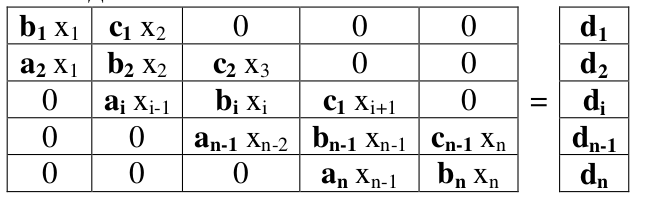
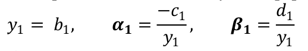
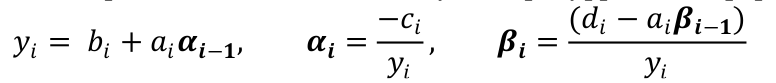
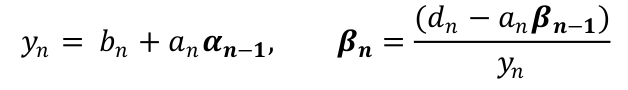
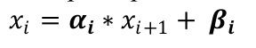
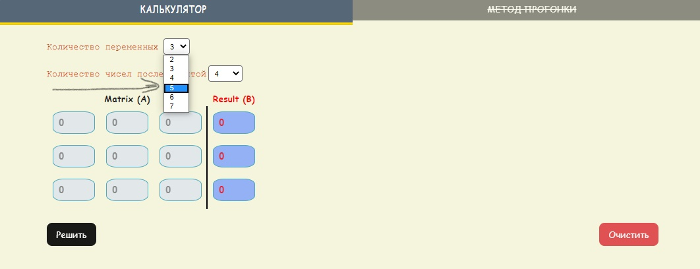
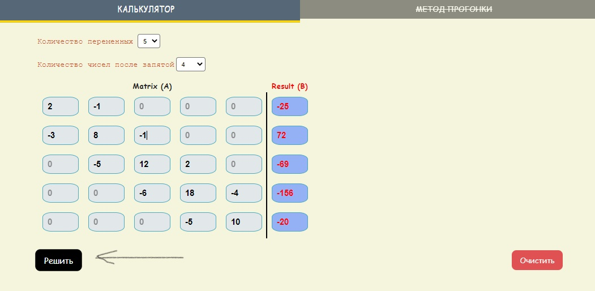
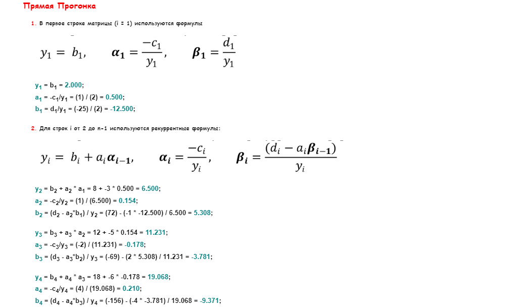
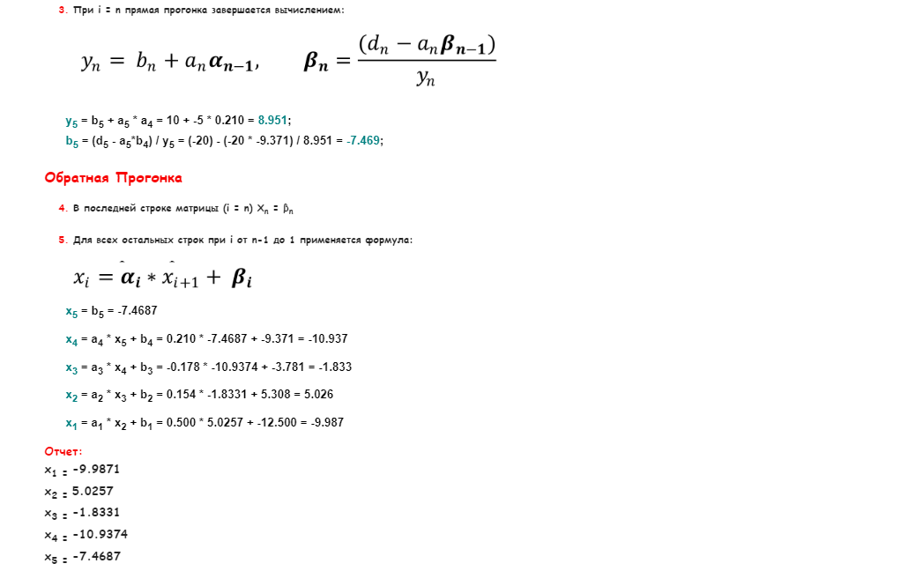

# [ссылка на калькулятор](https://baktybek0v.github.io/tridiagonal-matrix/)

# Калькулятор | Метод Прогонки

**Калькулятор** для решение **СЛАУ** с трёхдиагональной матрицей

> **Mетод прогонки** является частным случаем метода Гаусса и используется для решения
систем линейных уравнений вида **Ax = B**, где **A - трёхдиагональная матрица.**
Трёхдиагональной матрицей называется матрица такого вида, где во всех остальных
местах, кроме главной диагонали и двух соседних с ней, стоят нули.

Трёхдиагональная матрица:

Решений состоит из 2 этапов:
1. Прямая Прогонка
    - при i = 1

    
    - i > 1 и i < n

     
    - при i = n

     

2. Обратная Прогонка

    - 

___

## Пример решение

Количество переменных может доходить до 7

#### Пример
Количество неизвестных переменных = 5

  |   Ax  |   Ax    |    Ax   |    Ax    |    Ax    |     B     |
  |  ---  |   ---   |   ---   |   ---    |    ---   |    ---    |
  |   2   |   -1    |         |          |          |    -25    |
  |   -3  |    8    |   -1    |          |          |    72     |
  |       |   -5    |    12   |    2     |          |   -69     |
  |       |         |    -6   |    18    |    -4    |   -156    |
  |       |         |         |    -5    |    10    |    -20    |

### Показывается подробный шаг решение задачи
1. Прямая Прогонка

2. Обратная Прогонка

---
Все неизвестные переменные найдены

|   x   |   value  |
|  ---  |    ---   |
|   x1  |  -9.9871 |
|   x2  |  5.0257  |
|   x3  |  -1.8331 |
|   x4  | -10.9374 |
|   x5  | -7.4687  |
